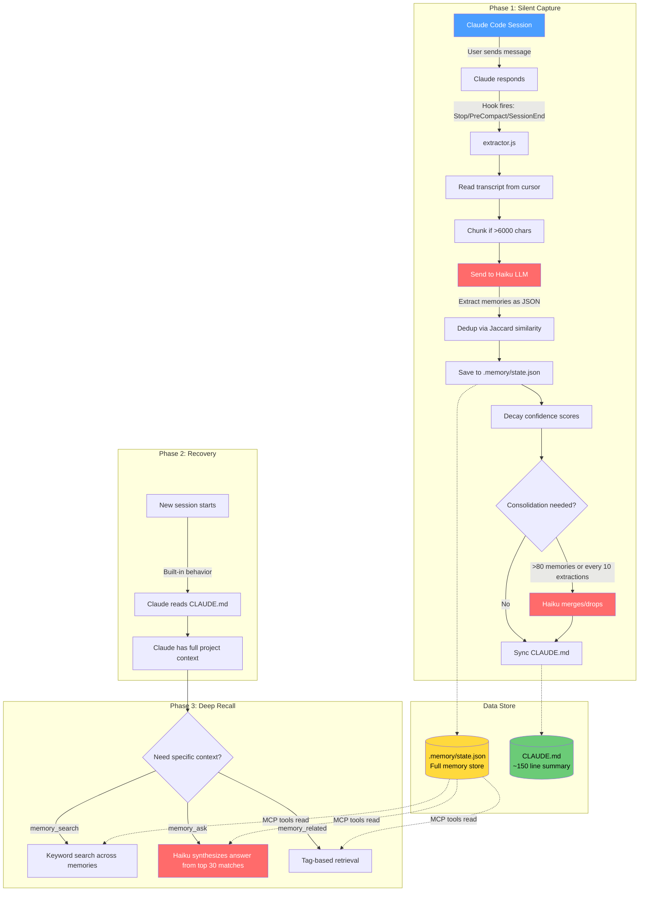

# memory-mcp

[](https://www.npmjs.com/package/claude-code-memory)
[](https://www.npmjs.com/package/claude-code-memory)
[](LICENSE)
[](package.json)
[](tsconfig.json)

**Persistent memory + automatic git snapshots for Claude Code.** Never lose context. Never lose code.

```
🧠 45 memories | 📊 2.8K tokens | 📸 23 snapshots | ⏱️ 5m ago
```

## Why memory-mcp?

| Problem | Solution |
|---------|----------|
| Re-explaining your project every session | Auto-captures decisions, patterns, architecture |
| Context window fills up, knowledge lost | Two-tier memory: CLAUDE.md (instant) + deep search |
| Broke something, can't remember what worked | Git snapshots on every save, instant rollback |
| No idea what Claude "knows" about your project | Visual dashboard shows all context |
| Worried about cloud storage | 100% local files, your git repo |

## What makes it different

- **Git Snapshots** — Every memory save commits your entire project. Roll back anytime.
- **Two-Tier Memory** — CLAUDE.md loads instantly, deep store searchable mid-conversation.
- **LLM-Powered** — Haiku extracts what matters, consolidates duplicates, prunes stale info.
- **Visual Dashboard** — See your context: tokens, memories by type, snapshot history.
- **Zero friction** — No commands to run. It just works silently.

## Quick Start

```bash
# Install globally
npm install -g claude-code-memory

# Interactive setup (API key + hooks)
memory-mcp setup

# Initialize a project
memory-mcp init ~/Projects/my-app
```

That's it. Start coding. Memories accumulate automatically.

## How It Works



**Two-tier memory architecture:**

| Layer | Purpose | Size |
|-------|---------|------|
| `CLAUDE.md` | Auto-read on session start. Top ~150 lines of the most important context. | Compact |
| `.memory/state.json` | Full memory store. Searchable via MCP tools mid-conversation. | Unlimited |

**Silent capture via hooks:**

Claude Code hooks fire after every response (`Stop`), before context compaction (`PreCompact`), and at session end (`SessionEnd`). A fast LLM (Haiku) reads the transcript and extracts:

- **Architecture** — how the system is structured
- **Decisions** — why X was chosen over Y
- **Patterns** — conventions and how things are done
- **Gotchas** — non-obvious pitfalls
- **Progress** — what's done, what's in flight
- **Context** — business context, deadlines, preferences

**Smart memory management:**

- Jaccard similarity deduplication (no duplicate memories)
- Confidence decay (progress fades after 7 days, context after 30)
- LLM-powered consolidation (merges overlapping memories, prunes stale ones)
- Line-budgeted CLAUDE.md (stays under ~150 lines, most important first)

## Updating

To update an existing installation:

```bash
npm install -g claude-code-memory --force
```

To update hooks (e.g., after a bug fix):

```bash
memory-mcp setup
```

## Requirements

- [Claude Code CLI](https://docs.anthropic.com/en/docs/claude-code)
- Node.js 18+
- Anthropic API key (for the Haiku-based extractor, ~$0.001 per extraction)

## CLI Commands

```
memory-mcp setup              Interactive first-time setup
memory-mcp init [dir]          Initialize memory for a project
memory-mcp status [dir]        Show memory status and health
memory-mcp statusline [dir]    Compact one-line status (great for shell prompts)
memory-mcp context [dir]       Show context metrics and token usage
memory-mcp context --html      Generate visual HTML dashboard
memory-mcp search <query>      Search memories by keyword
memory-mcp ask <question>      Ask a question, get answer from memory
memory-mcp consolidate [dir]   Merge duplicates, prune stale memories
memory-mcp key [api-key]       Set or check Anthropic API key
memory-mcp snapshots [dir]     List git snapshot history
memory-mcp snapshot-enable     Enable automatic git snapshots
memory-mcp snapshot-disable    Disable git snapshots
memory-mcp help                Show help
```

## Context Dashboard

Visualize your memory usage with `memory-mcp context`:

```
Context Dashboard

  Project: my-app

  Total Context
  2.8K estimated tokens

  Tier 1 CLAUDE.md (auto-loaded)
  █████████████████░░░░░░░░░░░░░ 1.0K
  45 lines, 44 in memory block

  Tier 2 .memory/state.json (searchable)
  ██████████████████████████████ 1.8K
  29 active, 5 archived, 24 superseded

  Memories by Type
  architecture ███░░░░░░░░░░░░░░░░░   8 memories (291 tokens)
  decision     ██████░░░░░░░░░░░░░░  18 memories (540 tokens)
  gotcha       ████░░░░░░░░░░░░░░░░  10 memories (332 tokens)
  progress     ██████░░░░░░░░░░░░░░  19 memories (538 tokens)

  Git Snapshots
  ● Enabled on __memory-snapshots
  42 commits → origin
```

Use `memory-mcp context --html` to generate an interactive browser dashboard.

## Git Snapshots

Automatic project versioning tied to your working sessions. Every memory extraction commits your entire project to a hidden branch.

```bash
# Enable during init (you'll be prompted)
memory-mcp init ~/Projects/my-app

# Or enable later
memory-mcp snapshot-enable

# View snapshot history
memory-mcp snapshots

# Compare two snapshots
memory-mcp snapshot-diff abc123 def456

# Restore to a previous state
memory-mcp snapshot-restore abc123

# Disable (preserves existing snapshots)
memory-mcp snapshot-disable
```

**How it works:**
- Commits go to `__memory-snapshots` branch (invisible in normal workflow)
- Optional push to remote (e.g., origin)
- Commit messages include what memories were extracted
- Full project state captured, not just memory files

**Use cases:**
- Roll back after breaking changes
- See what your project looked like during a specific session
- Track project evolution alongside context evolution

## MCP Tools (used by Claude mid-conversation)

When configured as an MCP server, Claude can access these tools during a session:

| Tool | Description |
|------|-------------|
| `memory_search` | Keyword search across all memories |
| `memory_related` | Get memories by tag or area |
| `memory_ask` | Ask a question, get an LLM-synthesized answer from memory |
| `memory_save` | Manually save a memory |
| `memory_recall` | List all memories with filters |
| `memory_delete` | Remove a memory |
| `memory_consolidate` | Trigger memory consolidation |
| `memory_consciousness` | Generate the full consciousness document |
| `memory_stats` | Show memory statistics |
| `memory_init` | Set project name and description |

## What Gets Stored

Memories are categorized into six types:

```
architecture   "Next.js 14 app router with Supabase backend, Stripe for billing"
decision       "Chose server components for public pages because of SEO requirements"
pattern        "All API routes validate input with zod and return NextResponse"
gotcha         "Supabase RLS policy on word_lists requires user_id OR org_id, not both"
progress       "Auth complete, billing webhook handling in progress"
context        "Client wants launch by March, focus on core features only"
```

## File Structure

After initialization, your project gets:

```
your-project/
├── CLAUDE.md              ← auto-updated memory summary (read on session start)
├── .memory/
│   ├── state.json         ← full memory store
│   └── cursor.json        ← tracks what's been processed
├── .mcp.json              ← MCP server configuration
└── .claude/
    └── settings.json      ← hook configuration
```

## CLAUDE.md Format

The memory block is inserted between markers, preserving any existing CLAUDE.md content:

```markdown
<!-- MEMORY:START -->
# MyProject
A brief description

_Last updated: 2026-01-27 | 45 active memories, 62 total_

## Architecture
- Next.js 14 app router with Supabase backend
- Auth via NextAuth with Google and email providers

## Key Decisions
- Chose server components for SEO pages
- Using Supabase RLS instead of API-level auth

## Patterns & Conventions
- All API routes use zod validation
- Tailwind only, no CSS modules

## Gotchas & Pitfalls
- RLS policy requires user_id OR org_id, not both

## Current Progress
- Auth: complete
- Billing: in progress

## Context
- Launch target: March

_For deeper context, use memory_search, memory_related, or memory_ask tools._
<!-- MEMORY:END -->
```

## Global vs Per-Project Install

**Global** (recommended): hooks work for all projects automatically.

```bash
memory-mcp setup  # select "global" when prompted
```

**Per-project**: hooks and MCP configured per project.

```bash
memory-mcp init /path/to/project
```

## Configuration

API key is resolved in order:
1. `ANTHROPIC_API_KEY` environment variable
2. `~/.memory-mcp/config.json`
3. `~/.config/anthropic/api_key`
4. `~/.anthropic/api_key`

## Cost

The extractor uses Claude Haiku for memory extraction and consolidation. Typical cost:

- ~$0.001 per extraction (after each Claude response)
- ~$0.005 per consolidation (every ~10 extractions)
- A full day of coding: ~$0.05–0.10

## License

MIT
